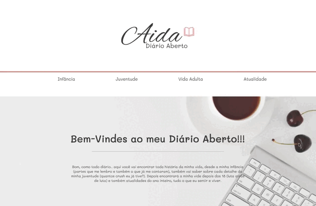

<h1 align="center">
  
</h1>

<h1>
  
</h1>

<h3 align="center">
  <a href="">Acessar demonstração</a>
</h3>

# Indice

- [Sobre](#-sobre)
- [Tecnologias utilizadas](#-tecnologias-utilizadas)
- [Tecnologias futuras](#-tecnologias-futuras)

---

## 🔖 Sobre

O **Blog Aida** surgiu antes de começar a programar com a intenção de torná-lo meu diário virtual. Com muita paixão pela área comecei a estudar e, depois de 1 mês aprendendo HTML, CSS e JS resolvi colocar em prática e ir aprendendo cada vez mais, vencendo todos os desafios de uma programadora!

Ainda não está completo, pois estou me dedicando todos os dias para melhorá-lo.

---

## 🚀 Tecnologias utilizadas

O projeto foi desenvolvido usando as seguintes tecnologias:

- [HTML](https://www.w3schools.com/html/)
- [CSS](https://www.w3schools.com/css/)

---

## 🎯 Tecnologias futuras

- [JavaScript](https://www.w3schools.com/js/)
- [PHP](https://www.w3schools.com/php/)
- [WordPress](https://br.wordpress.org/)

---

Desenvolvido por Thaís Aida Marques 🤍
